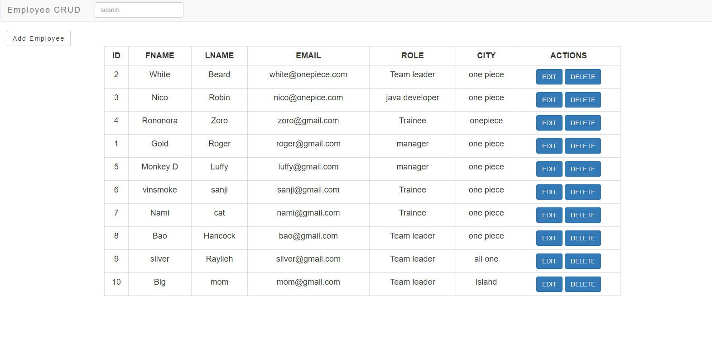

# Employee-CRUD-Servlet 

A **Model View Controller (MVC) Architecture** based application that performs basic **CRUD** operations build using Java Servlets and Java Server Pages (JSPs).

* **Client:** JSP, Bootstrap, JavaScript
* **Backend:** Servlets, JDBC ,Postgres(Database) & Connection Pooling
* **Libraries:** GSON(Json serialisation and deserialisation), JDBC driver jar, Servlet jar

## Interface

#### Main page
 

#### Form page
 

